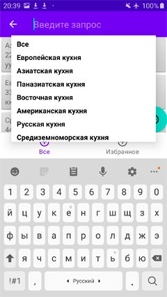
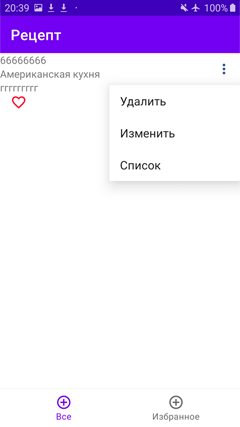

### Фрагмент со списком рецептов:
Добавил возможность выбора по названию кухни
RecipeListFragment

при нажатии на элементе списка, переходим на другой фрагмент

### Фрагмент с одним рецептом и возможностью выбора из меню трёх опций
Popup меню я починил, добавил сердечко, которое добавляет в "Избранное" 

SingleRecipeFragment

при выборе опции "Изменить", переходим на третий фрагмент, где можно редактировать
существующий рецепт - изменить значения текстовых полей для названия и содержания рецепта
и выбрать кухню

NewRecipeFragment

при нажатии плавающей кнопки, изменения сохраняются и возвращаемся на предыдущий
фрагмент с выпадающим меню 

### Фрагмент с навигацией

##  К сожалению при запуске приложения и при выборе кухни,
## на экране ничего не появляется пока не поменяется ориентация устройства -   с этой проблемой я так и не успел справиться 

