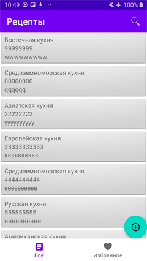
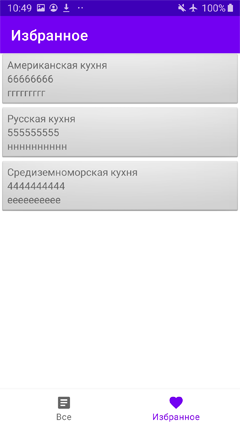

Я учёл все замечания к предыдущей версии и теперь задание приняло такой вид
### Фрагмент со списком рецептов:
Фрагмент со всеми рецептами появляется сразу при запуске приложения

RecipeListFragment

с помощью плавающей кнопки добавляется новый рецепт

### Фрагмент с избранным
Для перехода используется кнопка навигации 

FavoriteFragment

На первом экране можно сделать выборку по типу кухни

Тап на элементе списка переводит на экран, где можно рецепт редактировать и добавлять(удалять) в избранное

SingleRecipeFragment

при выборе опции "Изменить", переходим на фрагмент, где можно редактировать
существующий рецепт - изменить значения текстовых полей для названия и содержания рецепта
и выбрать кухню

NewRecipeFragment

при нажатии плавающей кнопки, изменения сохраняются и возвращаемся на предыдущий
экран. 

Весь лишний код вроде-бы удалил -)
 

