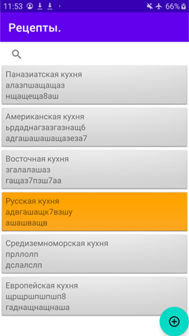
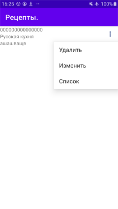
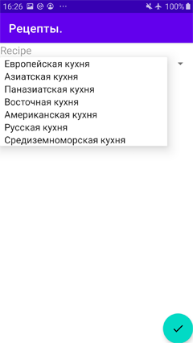

К сожалению полностью выполнить не успел, к дизайну пока совсем не приступал. 

## К настоящему моменту готов следующий функционал:

### Фрагмент со списком рецептов:
RecipeListFragment

при нажатии на элементе списка, переходим на другой фрагмент

### Фрагмент с одним рецептом и возможностью выбора из меню трёх опций 

SingleRecipeFragment

при выборе опции "Изменить", переходим на третий фрагмент, где можно редактировать
существующий рецепт - изменить значения текстовых полей для названия и содержания рецепта
и выбрать кухню

NewRecipeFragment

при нажатии плавающей кнопки, изменения сохраняются и возвращаемся на предыдущий
фрагмент с выпадающим меню 

## И здесь появляется проблема!
При тапе на иконке popup меню приложение валится с таким сообщением

`E/AndroidRuntime: FATAL EXCEPTION: main
    Process: ru.netology.nmedia, PID: 9480
    android.view.WindowManager$BadTokenException: Unable to add window -- token null is not valid; is your activity running?
        at android.view.ViewRootImpl.setView(ViewRootImpl.java:1066)
        at android.view.WindowManagerGlobal.addView(WindowManagerGlobal.java:381)
        at android.view.WindowManagerImpl.addView(WindowManagerImpl.java:93)
        at android.widget.PopupWindow.invokePopup(PopupWindow.java:1478)
        at android.widget.PopupWindow.showAsDropDown(PopupWindow.java:1316)
        at android.widget.ListPopupWindow.show(ListPopupWindow.java:743)
        at com.android.internal.view.menu.StandardMenuPopup.tryShow(StandardMenuPopup.java:239)
        at com.android.internal.view.menu.StandardMenuPopup.show(StandardMenuPopup.java:274)
        at com.android.internal.view.menu.MenuPopupHelper.showPopup(MenuPopupHelper.java:276)
        at com.android.internal.view.menu.MenuPopupHelper.tryShow(MenuPopupHelper.java:168)
        at com.android.internal.view.menu.MenuPopupHelper.show(MenuPopupHelper.java:134)
        at android.widget.PopupMenu.show(PopupMenu.java:227)
        at ru.netology.diploma.SingleRecipeFragment.onCreateView$lambda-1$lambda-0(SingleRecipeFragment.kt:56)
        at ru.netology.diploma.SingleRecipeFragment.$r8$lambda$-Eh0nZaur8RKrSiNfP7v5BLhv8c(Unknown Source:0)
        at ru.netology.diploma.SingleRecipeFragment$$ExternalSyntheticLambda0.onClick(Unknown Source:2)
        at android.view.View.performClick(View.java:7341)
        at android.widget.TextView.performClick(TextView.java:14215)
        at com.google.android.material.button.MaterialButton.performClick(MaterialButton.java:1131)
        at android.view.View.performClickInternal(View.java:7307)
        at android.view.View.access$3200(View.java:846)
        at android.view.View$PerformClick.run(View.java:27796)
        at android.os.Handler.handleCallback(Handler.java:873)
        at android.os.Handler.dispatchMessage(Handler.java:99)
        at android.os.Looper.loop(Looper.java:214)
        at android.app.ActivityThread.main(ActivityThread.java:7156)
        at java.lang.reflect.Method.invoke(Native Method)
        at com.android.internal.os.RuntimeInit$MethodAndArgsCaller.run(RuntimeInit.java:494)
        at com.android.internal.os.ZygoteInit.main(ZygoteInit.java:975)
I/Process: Sending signal. PID: 9480 SIG: 9
Disconnected from the target VM, address: 'localhost:50054', transport: 'socket'`

Это в случае, если меню создаётся таким образом:

`PopupMenu(activity!!.baseContext, view?.findViewById(R.id.options))`

Если же меню создаётся таким образом:
`PopupMenu(context,view?.findViewById(R.id.options))`,
то всё работает, но меню появляется не на том месте

Ну а в остальном команды CRUD работают, изменения в SQLITE ,базе сохраняются, дело
движется и нужно только ещё время, чтобы задача была решена :-)
        
